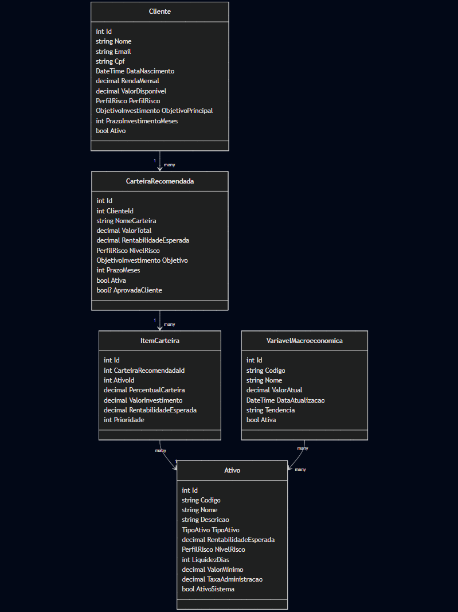

# Thetis – Assessor Virtual de Investimentos
API **ASP.NET Core** para recomendação de investimentos, com **Entity Framework Core** + **Oracle 19c**, **AutoMapper**, **Swagger** e **manipulação de arquivos (JSON/TXT)** para backup e importação.

> **Stack:** .NET 8, EF Core 9, Oracle.EntityFrameworkCore, AutoMapper, Swashbuckle (Swagger).

---

## Integrantes

- Júlia Marques Mendes das Neves	(RM98680)
- Kaiky Alvaro Miranda	(RM98118)
- Lucas Rodrigues da Silva	(RM98344)
- Juan Pinheiro de França	(RM552202)
- Matheus Gusmão Aragão	(RM550826)

---

## Funcionalidades

* **CRUD completo**

  * Clientes
  * Ativos
  * Carteiras recomendadas (geração e análise)
  * Variáveis macroeconômicas (opcional, usada para relatórios e contexto)
* **Recomendações**

  * Geração de carteira por perfil de risco/objetivo/prazo
  * Aprovação de carteira
  * Análise de diversificação
  * Simulação de rendimento
* **Arquivos**

  * Exportação **JSON** (snapshot dos dados)
  * Exportação **TXT** (relatório resumido)
  * Importação **JSON** (upsert de Ativos, Clientes e Variáveis)
* **Documentação**

  * Swagger UI na raiz `/`
  * Código limpo e camadas separadas

---

## Arquitetura

```
Thetis/
├── ThetisApi/      # API Web ASP.NET Core (Controllers, Swagger, DI/Startup)
├── ThetisService/  # Regras de negócio (Services, AutoMapper)
├── ThetisData/     # Acesso a dados (DbContext, Repository, Migrations)
├── ThetisModel/    # Contratos: Entidades, DTOs, ViewModels, Enums
└── Thetis.sln
```

### Camadas & responsabilidades

* **ThetisApi**: expõe endpoints REST, valida entrada e retorna respostas padronizadas. Somente orquestra — não contém regra de negócio.
* **ThetisService**: implementa **use cases** (ex.: gerar recomendação, simular rendimento, CRUD lógico). Usa AutoMapper para mapear DTO/VM ⇄ Entity.
* **ThetisData**: **EF Core** + **Oracle 19c**. `AppDbContext`, Repository genérico, Migrations, conversores (bool ⇄ CHAR(1) Y/N).
* **ThetisModel**: tipos compartilhados (Entities/DTOs/ViewModels/Enums). Sem dependência de infraestrutura.

### Diagrama de Componentes
.png)

### Diagrama de domínio


---

## Configuração

### 1) Connection String

`appsettings.json` (ou Secrets):

```json
{
  "ConnectionStrings": {
    "Oracle": "User Id=xxxxx;Password=xxxxx;Data Source=host:1521/ORCL;"
  }
}
```

### 2) Dependências

* .NET 8 SDK
* Oracle Client
* Pacotes NuGet principais:

  * `Oracle.EntityFrameworkCore`
  * `Microsoft.EntityFrameworkCore.Design`
  * `AutoMapper.Extensions.Microsoft.DependencyInjection`
  * `Swashbuckle.AspNetCore`

---

## Banco & Migrations
> Oracle 19c não possui `BOOLEAN`. O projeto aplica conversores globais para **CHAR(1)** com valores **'Y'/'N'**.

Comandos comuns:

```bash
# gerar migration
dotnet ef migrations add Initial

# aplicar migration no banco
dotnet ef database update
```

---

## Executando

```bash
dotnet restore
dotnet run
```

* Swagger UI disponível em: **[https://localhost:7294/](https://localhost:7294/)**
* JSON da especificação: **/swagger/v1/swagger.json**

---

## Endpoints Principais

### Clientes (`/Clientes`)

* `GET /Clientes/GetAll`
* `GET /Clientes/GetById/{id}`
* `GET /Clientes/GetPerfil/{id}`
* `POST /Clientes/Create`
* `PUT /Clientes/Update/{id}`
* `DELETE /Clientes/Delete/{id}`

### Ativos (`/Ativos`)

* `GET /Ativos/GetAll`
* `GET /Ativos/GetById/{id}`
* `GET /Ativos/GetByCodigo/{codigo}`
* `GET /Ativos/GetByTipo?tipo=1`
* `GET /Ativos/GetByPerfilRisco?perfil=2`
* `POST /Ativos/Create`
* `PUT /Ativos/Update/{id}`
* `DELETE /Ativos/Delete/{id}`

### Recomendações (`/Recomendacoes`)

* `POST /Recomendacoes/GerarRecomendacao`
* `GET /Recomendacoes/GetByCliente/{clienteId}`
* `GET /Recomendacoes/GetById/{id}`
* `PATCH /Recomendacoes/AprovarCarteira/{id}?aprovada=true`
* `GET /Recomendacoes/AnalisarDiversificacao/{id}`
* `GET /Recomendacoes/SimularRendimento/{id}?meses=12`

### Variáveis macro (`/Variaveis`)

* `GET /Variaveis/GetAll`
* `GET /Variaveis/GetByCodigo/{codigo}`
* `PUT /Variaveis/Update/{id}`
* `GET /Variaveis/Relatorio`

### Backup / Arquivos (`/Backup`)

* `GET /Backup/ExportJson` → baixa JSON e salva cópia em `App_Data`
* `GET /Backup/RelatorioTxt` → baixa TXT e salva cópia em `App_Data`
* `POST /Backup/import-json` (body JSON) → importa clientes/ativos/variáveis

---

## Exemplos de Requisições

### Criar Cliente

```http
POST /Clientes/Create
Content-Type: application/json

{
  "nome": "Maria Silva",
  "email": "maria.silva@example.com",
  "cpf": "12345678901",
  "dataNascimento": "1995-03-12",
  "rendaMensal": 6500.00,
  "valorDisponivel": 15000.00,
  "perfilRisco": 2,
  "objetivoPrincipal": 3,
  "prazoInvestimentoMeses": 36
}
```

### Gerar Recomendação

```http
POST /Recomendacoes/GerarRecomendacao
Content-Type: application/json

{
  "clienteId": 1,
  "ativosDisponiveis": [ /* opcional */ ],
  "valorInvestimento": 10000,
  "objetivo": 3,
  "prazoMeses": 24,
  "considerarVariaveisMacroeconomicas": true
}
```

### Importar Backup (JSON no body)

```http
POST /Backup/import-json
Content-Type: application/json

{
  "Data": "2025-09-21T12:00:00Z",
  "Ativos": [
    {
      "Codigo": "CDBBANCOX",
      "Nome": "CDB Banco X",
      "Descricao": "CDB liquidez diária",
      "TipoAtivo": 1,
      "RentabilidadeEsperada": 12.5,
      "NivelRisco": 1,
      "LiquidezDias": 1,
      "ValorMinimo": 1000.00,
      "TaxaAdministracao": 0.00
    }
  ],
  "Clientes": [
    {
      "Nome": "Maria Silva",
      "Email": "maria.silva@example.com",
      "Cpf": "123.456.789-01",
      "DataNascimento": "1995-03-12",
      "RendaMensal": 6500.00,
      "ValorDisponivel": 15000.00,
      "PerfilRisco": 2,
      "ObjetivoPrincipal": 3,
      "PrazoInvestimentoMeses": 36,
      "Ativo": true
    }
  ],
  "Variaveis": [
    {
      "Nome": "Taxa Selic",
      "Codigo": "SELIC",
      "Descricao": "Taxa básica de juros",
      "ValorAtual": 10.50,
      "ValorAnterior": 10.25,
      "DataReferencia": "2025-09-01",
      "UnidadeMedida": "%",
      "FonteDados": "BACEN",
      "Tendencia": "ESTAVEL",
      "ImpactoInvestimentos": "Aumenta atratividade de renda fixa",
      "Ativa": true
    }
  ]
}
```

---

## Convenções & Notas

* **Booleans Oracle 19c:** mapeados para `CHAR(1)` com conversores globais `'Y'/'N'`.
* **Soft delete:** alguns registros usam flags (`Ativo`, `AtivoSistema`) em vez de DELETE.
* **Únicos:** índices em CPF, Email, Código de Ativo, Código de Variável.
* **Case-insensitive:** buscas de código normalizam para maiúsculas e email para minúsculas.
* **Swagger**: sempre ativo.
